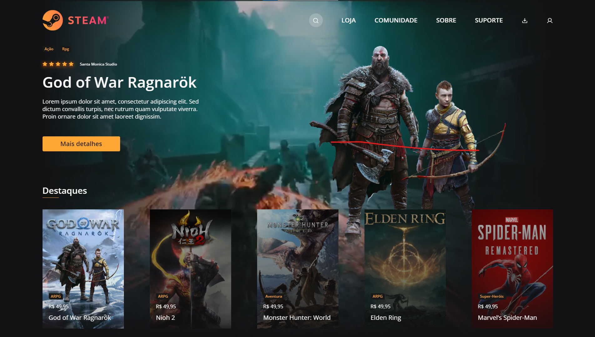
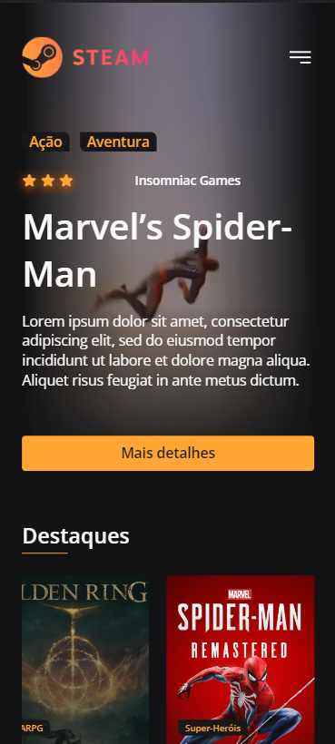
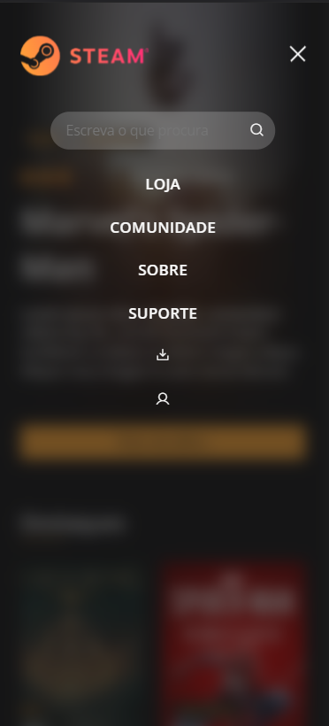

<h1 align="center">
  Steam Fake
</h1>

  
  
  
  
  

  
  
  

  

## 💻 Projeto
Projeto feito com proposito de pôr a prova as habilidades aprendidas nos últimos meses, criando um site fictício baseado na steam com seu design básico vindo de
uns dos desafios criados no [Figma](https://www.figma.com/file/Yb9IBH56g7T1hdIyZ3BMNO?node-id=80254%3A868) pelo [**Iuri Silva**](https://www.instagram.com/iuricode/).

[Site aqui](http://steam-fic.vercel.app/)

## 🚀 Tecnologias
  

- HTML
- CSS
- Javascript

## 📔 Conhecimentos fortalecidos

- [x] Uso básico do figma .
- [x] Tokens no projeto`.
- [x] css e responsividade.
- [x] Javascript.
- [x] Criação de itens em listas.
- [x] Tecnicas de animação em css.

  
  

